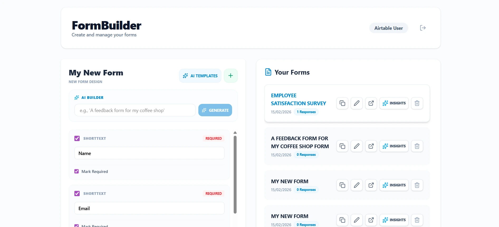
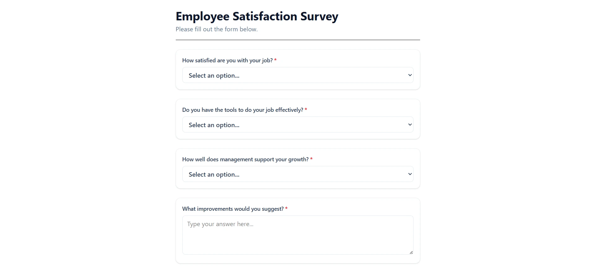
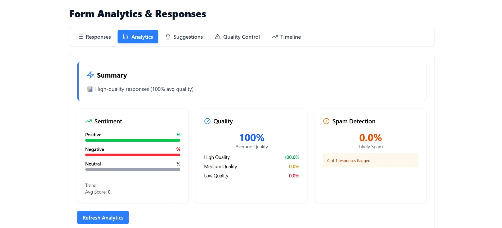

# Form Builder

An AI-powered form builder with dynamic logic, OAuth authentication, Airtable integration, and advanced analytics like sentiment analysis, spam detection, and response insights.

## 📋 Problem Statement

Businesses and individuals need an easy way to create dynamic forms, collect responses, and analyze data without coding expertise. Traditional form builders lack advanced analytics, conditional logic, and secure integrations.

## 🛠️ Problem–Solution Mapping

| Problem | Solution |
|---------|----------|
| Static form structures limit user experience | Dynamic conditional logic for show/hide fields based on user input |
| Manual data analysis is time-consuming | AI-powered sentiment analysis, spam detection, and quality scoring |
| Lack of integration with external tools | Seamless Airtable integration with OAuth authentication |
| Security concerns with form submissions | Multi-provider OAuth (Airtable & Google) with JWT session management |
| No insights into response patterns | Comprehensive analytics dashboard with timelines and key phrase extraction |

## 🔍 What is Implemented

Full-stack form builder with React frontend, Node.js backend, MongoDB database. Features include OAuth authentication, dynamic forms with conditional logic, AI-powered analytics (sentiment, spam detection, quality scoring), and Airtable integration.

## 🏗️ Solution Overview

The solution consists of a modern web application architecture:

- **Frontend**: Single-page application built with React 19, providing an intuitive dashboard for form creation and management
- **Backend**: RESTful API server handling authentication, form operations, and AI analytics
- **Database**: MongoDB for storing users, forms, and responses
- **AI Integration**: Hugging Face models for natural language processing tasks
- **External Integrations**: Airtable API for data synchronization and OAuth flows

The application follows a microservices-like structure with clear separation of concerns across controllers, models, and utilities.

## 🌟 Project Highlights

- **AI-First Approach**: Leverages free AI models for advanced features like form generation from natural language prompts
- **Secure Authentication**: Implements OAuth 2.0 flows with PKCE for Airtable and standard OAuth for Google
- **Scalable Architecture**: Modular backend with middleware for validation, rate limiting, and error handling
- **Modern UI/UX**: Responsive design with smooth animations and mobile-first approach
- **Comprehensive Analytics**: Multi-dimensional analysis including sentiment, quality, and temporal patterns

## ✨ Features

- 🔐 **Multi-Provider Authentication**: Secure login via Airtable OAuth (PKCE) and Google OAuth
- 📝 **Dynamic Form Builder**: Create forms with text, long text, and single-select field types
- 🎯 **Conditional Logic**: Advanced visibility rules with AND/OR conditions for dynamic field display
- 📊 **Response Management**: Collect, store, and export form responses with rate limiting
- 🔗 **Airtable Integration**: Browse bases, sync data, and manage OAuth tokens
- 🤖 **AI Form Generation**: Generate complete forms from natural language descriptions
- 📋 **Form Templates**: Access pre-built templates for common use cases
- 😊 **Sentiment Analysis**: Detect positive, negative, and neutral feedback trends
- 🚫 **Spam Detection**: Identify and flag suspicious responses
- ⭐ **Quality Scoring**: Rate response completeness and detail
- 🔑 **Key Phrase Extraction**: Discover themes and top keywords from responses
- 💡 **Smart Suggestions**: Real-time recommendations for form structure improvements
- 📈 **Analytics Dashboard**: Comprehensive insights with timelines and discoverability
- 📱 **Responsive Design**: Mobile-friendly interface with Tailwind CSS and Framer Motion

## 📸 Screenshots







## 🛠️ Tech Stack

- **Frontend**: React, Vite, Tailwind CSS
- **Backend**: Node.js, Express.js
- **Database**: MongoDB
- **Authentication**: JWT + OAuth
- **AI**: Hugging Face Inference

## 🚀 Installation / Setup Steps

### Prerequisites
- Node.js (v18 or higher)
- MongoDB instance (local or cloud)
- Airtable account with API access
- Google OAuth credentials
- Hugging Face API token (optional, for AI features)

### Backend Setup

1. **Clone and navigate to backend directory:**
   ```bash
   cd form-builder-backend
   npm install
   ```

2. **Create environment file:**
   Create `.env` file with the following variables:
   ```env
   PORT=5000
   MONGODB_URI=mongodb://localhost:27017/form-builder
   JWT_SECRET=your-secure-jwt-secret
   AIRTABLE_CLIENT_ID=your-airtable-client-id
   AIRTABLE_CLIENT_SECRET=your-airtable-client-secret
   AIRTABLE_BASE_ID=your-airtable-base-id
   AIRTABLE_TABLE_NAME=your-table-name
   GOOGLE_CLIENT_ID=your-google-client-id
   GOOGLE_CLIENT_SECRET=your-google-client-secret
   HUGGINGFACE_API_KEY=your-huggingface-token
   ```

3. **Start the backend server:**
   ```bash
   node server.js
   ```
   Server runs on `http://localhost:5000`

### Frontend Setup

1. **Navigate to frontend directory:**
   ```bash
   cd ../form-builder-frontend
   npm install
   ```

2. **Start development server:**
   ```bash
   npm run dev
   ```
   Application available at `http://localhost:5173`

### Production Build

```bash
cd form-builder-frontend
npm run build
npm run preview
```

## 📚 Key Learnings

- **OAuth Implementation**: Deep understanding of OAuth 2.0 flows, PKCE, and secure token management
- **AI Integration**: Practical experience with Hugging Face models and NLP processing pipelines
- **Full-Stack Architecture**: Designing scalable APIs with proper separation of concerns
- **Modern React Patterns**: Leveraging React 19 features, hooks, and concurrent rendering
- **Database Design**: MongoDB schema design for forms, responses, and user management
- **Security Best Practices**: Implementing rate limiting, input validation, and secure authentication
- **UI/UX Design**: Creating responsive, accessible interfaces with modern CSS frameworks

## 🔮 Future Improvements

- **Advanced Field Types**: Support for file uploads, multi-select, date/time, and rating fields
- **Workflow Automation**: Integration with Zapier or similar for automated actions on form submissions
- **Real-time Collaboration**: Multi-user editing with live cursors and conflict resolution
- **Advanced Analytics**: Predictive analytics and A/B testing for form optimization
- **Mobile App**: Native mobile applications for iOS and Android
- **Multi-language Support**: Internationalization with support for multiple languages
- **API Rate Limiting**: More granular rate limiting based on user tiers
- **Backup & Recovery**: Automated database backups and disaster recovery procedures

## 📬 Contact

**Samiksha Balaji Lone**  
📧 samikshalone2@gmail.com  
🔗 [LinkedIn](https://linkedin.com/in/samiksha-lone) | [Portfolio](https://samiksha-lone.vercel.app/)